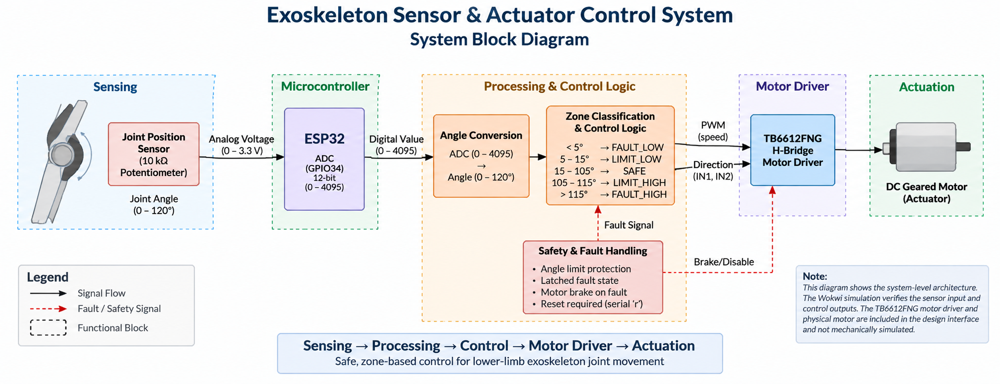
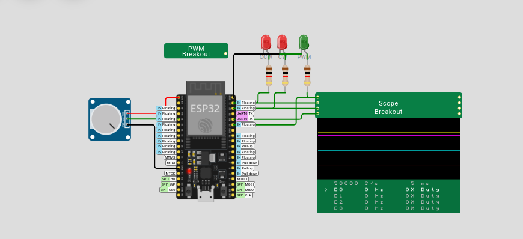
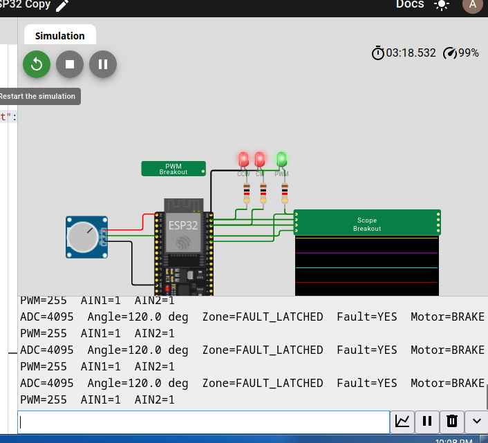
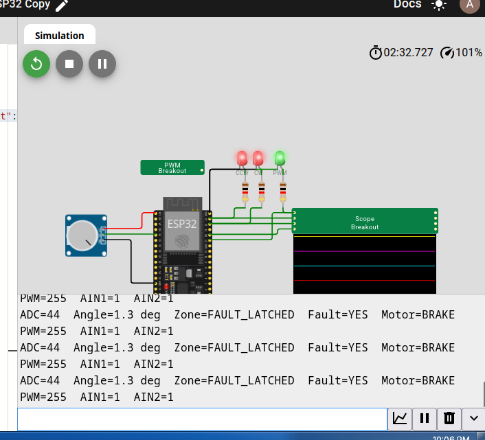

# Exoskeleton Sensor & Actuator Control System

> **Embedded control prototype for a single lower-limb exoskeleton joint, implementing joint-position sensing, angle conversion, zone-based control, actuator commands, and latched safety faults.**

**C-ROB TKMCE Internship Selection Task — Embedded Systems, Biomedical Electronics & Power Systems**


---

> [!WARNING]
> **This project is a prototype/simulation for an internship selection task.**
> It is **not a medical device** and has not undergone human-subject, clinical,
> mechanical, or physical hardware safety validation.

---

## Submission

| Resource | Link |
|---|---|
| 📄 Final Technical Report | [`report/Exoskeleton_Final_Submission_Report.pdf`](report/Exoskeleton_Final_Submission_Report.pdf) |
| 💻 ESP32 Firmware | [`sketch.ino`](sketch.ino) |
| 🧪 Wokwi Configuration | [`diagram.json`](diagram.json) |
| 🖥️ Simulation Evidence | [`figures/`](figures/) |
| 🌐 Wokwi | [Open Wokwi](https://wokwi.com/) |

---

## Project Status

This submission demonstrates the **sensor → microcontroller → control logic → actuator-command** chain through simulation.

| Component / Function | Status |
|---|---|
| ESP32 firmware | ✅ Implemented |
| Potentiometer sensing | ✅ Simulated |
| ADC-to-angle conversion | ✅ Verified |
| Five-zone angle classification | ✅ Verified |
| PWM generation | ✅ Verified |
| Direction control outputs | ✅ Verified |
| Fault latching | ✅ Verified |
| Brake command on fault | ✅ Verified |
| Serial fault reset | ✅ Verified |
| TB6612FNG interface | 📐 Design-level |
| DC geared motor | 📐 Proposed actuator |
| Mechanical joint coupling | ❌ Not simulated |
| Physical motor rotation | ❌ Not tested |
| Physical emergency-stop | ❌ Not tested |
| Mechanical end-stops | ❌ Not tested |
| Motor current / thermal validation | ❌ Not performed |
| Clinical / human testing | ❌ Not performed |

---

## Overview

The project implements a prototype control system for a **single-degree-of-freedom lower-limb exoskeleton joint**.

A **10 kΩ linear potentiometer** represents the joint-position sensor. An **ESP32** reads the sensor through its ADC, converts the 12-bit ADC value into a prototype **0–120° joint-angle range**, and classifies the angle into one of five control zones.

The resulting control logic generates **PWM and direction signals** for a proposed **TB6612FNG H-bridge motor driver**, which would drive a small brushed DC geared motor in a physical implementation.

The control system includes software-level hard-limit fault detection. When the angle exceeds the defined low or high fault threshold, the fault is latched and the motor command changes to **BRAKE** until a manual serial reset is performed.

---

## System Architecture



### Control Chain

```text
┌──────────────────────┐
│ Joint Position Sensor│
│ 10 kΩ Potentiometer  │
└──────────┬───────────┘
           │
           ▼
┌──────────────────────┐
│ ESP32 ADC             │
│ GPIO34                │
└──────────┬───────────┘
           │
           ▼
┌──────────────────────┐
│ ADC → Angle           │
│ 0–4095 → 0–120°      │
└──────────┬───────────┘
           │
           ▼
┌──────────────────────┐
│ Zone Classification   │
│ & Control Logic       │
└──────────┬───────────┘
           │
           ▼
┌──────────────────────┐
│ PWM + Direction       │
└──────────┬───────────┘
           │
           ▼
┌──────────────────────┐
│ TB6612FNG H-Bridge    │
│ Design-Level          │
└──────────┬───────────┘
           │
           ▼
┌──────────────────────┐
│ DC Geared Motor       │
│ Proposed Actuator     │
└──────────────────────┘
````

---

## Key Features

* 10 kΩ linear potentiometer-based joint-position sensing
* ESP32 12-bit ADC acquisition
* Prototype 0–120° joint-angle conversion
* Five-zone angle-based control
* PWM-based boundary-return commands
* Direction control through AIN1/AIN2
* Latched low/high fault states
* Brake command during fault
* Manual serial fault reset
* Wokwi-based simulation
* Design-level TB6612FNG actuator interface
* Serial telemetry for verification

---

# Hardware and Interfaces

## Sensor Interface

The joint-position sensor is represented by a **10 kΩ linear potentiometer**.

| Parameter             |                      Value |
| --------------------- | -------------------------: |
| Sensor                | 10 kΩ linear potentiometer |
| ESP32 input           |                     GPIO34 |
| ADC resolution        |                     12 bit |
| ADC range             |                     0–4095 |
| Prototype angle range |                     0–120° |

The firmware performs the following conversion:

```cpp
jointAngle = ((float)potRaw / 4095.0) * 120.0;
```

Therefore:

```text
ADC = 0       → 0°
ADC = 4095    → 120°
```

The 0–120° range is a **prototype/simulation assumption** and is not presented as a clinical joint range-of-motion specification.

---

## ESP32 / Motor-Driver Interface

The proposed physical actuator interface uses a **TB6612FNG H-bridge**.

| Signal              | ESP32 GPIO | Function                 |
| ------------------- | ---------: | ------------------------ |
| Potentiometer wiper |     GPIO34 | Joint-position ADC input |
| PWM                 |     GPIO21 | Motor speed command      |
| AIN1                |     GPIO22 | Direction bit 1          |
| AIN2                |     GPIO23 | Direction bit 2          |
| STBY                |     GPIO16 | Driver enable            |

`STBY` is held HIGH during normal operation.

The actual Wokwi simulation verifies the ESP32 sensing and control outputs. The TB6612FNG + motor stage is represented as a **design-level physical interface**, not as a physically tested motor assembly.

---

# Control Logic

The firmware uses five angle zones.

| Zone         |      Angle | Motor Action | Fault |
| ------------ | ---------: | ------------ | ----- |
| `FAULT_LOW`  |     `< 5°` | BRAKE        | Yes   |
| `LIMIT_LOW`  |    `5–15°` | FORWARD      | No    |
| `SAFE`       |  `15–105°` | STOP         | No    |
| `LIMIT_HIGH` | `105–115°` | REVERSE      | No    |
| `FAULT_HIGH` |   `> 115°` | BRAKE        | Yes   |

The LIMIT zones generate angle-dependent PWM commands intended to return the joint away from the corresponding boundary.

### LIMIT_LOW

For angles from **5° to 15°**, the controller commands:

```text
Direction: FORWARD
PWM:       180 → 80
```

### SAFE

For angles from **15° to 105°**:

```text
Motor: STOP
PWM:   0
```

### LIMIT_HIGH

For angles from **105° to 115°**, the controller commands:

```text
Direction: REVERSE
PWM:       80 → 180
```

PWM is constrained to the range:

```text
80–180
```

within the LIMIT zones.

---

# Motor Command Truth Table

| Command | AIN1 | AIN2 |    PWM |
| ------- | ---: | ---: | -----: |
| STOP    |    0 |    0 |      0 |
| FORWARD |    0 |    1 | 80–180 |
| REVERSE |    1 |    0 | 80–180 |
| BRAKE   |    1 |    1 |    255 |

The direction and PWM outputs are verified through the Wokwi simulation.

---

# Fault Handling

Two software-level hard-limit conditions are implemented:

```text
Angle < 5°     → FAULT_LOW
Angle > 115°   → FAULT_HIGH
```

When either condition occurs:

1. `faultLatched` is set.
2. The controller enters the latched fault state.
3. The motor command changes to `BRAKE`.
4. The fault remains active even if the potentiometer angle subsequently changes.
5. Normal operation can resume only after a manual serial reset.

### Fault reset

Enter:

```text
r
```

or:

```text
R
```

in the Serial Monitor.

The reset clears the latched fault, commands the motor to STOP, and allows normal zone evaluation to resume.

---

# Simulation Verification

The control system was verified in Wokwi using an ESP32, potentiometer, output indicators, and scope signals.

The potentiometer was manually adjusted to emulate changes in joint position.

## Verified Test Cases

| Test Case       |  ADC |  Angle | Zone          | Motor   | PWM | AIN1/AIN2 |
| --------------- | ---: | -----: | ------------- | ------- | --: | --------- |
| SAFE            | 1973 |  57.8° | SAFE          | STOP    |   0 | 0 / 0     |
| LIMIT_LOW       |  304 |   8.9° | LIMIT_LOW     | FORWARD | 150 | 0 / 1     |
| LIMIT_HIGH      | 3611 | 105.8° | LIMIT_HIGH    | REVERSE |  80 | 1 / 0     |
| FAULT_LOW       |   44 |   1.3° | FAULT_LATCHED | BRAKE   | 255 | 1 / 1     |
| FAULT_HIGH      | 4095 | 120.0° | FAULT_LATCHED | BRAKE   | 255 | 1 / 1     |
| After `r` reset |    — |  57.8° | SAFE          | STOP    |   0 | 0 / 0     |

---

## Simulation Circuit



The Wokwi circuit is used to verify the sensing and generated control signals.

It does **not** contain a physically coupled exoskeleton joint or a physically rotating motor.

---

## Fault Verification

### High-Angle Fault



At the maximum simulated ADC value:

```text
ADC       = 4095
Angle     = 120.0°
Zone      = FAULT_LATCHED
Fault     = YES
Motor     = BRAKE
PWM       = 255
AIN1/AIN2 = 1 / 1
```

### Low-Angle Fault



At a low simulated ADC value:

```text
ADC       = 44
Angle     = 1.3°
Zone      = FAULT_LATCHED
Fault     = YES
Motor     = BRAKE
PWM       = 255
AIN1/AIN2 = 1 / 1
```

---

# Other Simulation Evidence

Individual verification screenshots are included in the repository:

* [`serial_safe.png`](figures/serial_safe.png)
* [`serial_limit_low.png`](figures/serial_limit_low.png)
* [`serial_limit_high.png`](figures/serial_limit_high.png)
* [`serial_fault_low.png`](figures/serial_fault_low.png)
* [`serial_fault_high.png`](figures/serial_fault_high.png)

---

# Quick Start — Wokwi

The simulation can be reproduced using the included firmware and Wokwi circuit definition.

## 1. Open Wokwi

Visit:

**[https://wokwi.com/](https://wokwi.com/)**

Create or open an ESP32 Arduino project.

## 2. Load the firmware

Replace the project firmware with:

[`sketch.ino`](sketch.ino)

## 3. Load the circuit

Use:

[`diagram.json`](diagram.json)

## 4. Start the simulation

Run the Wokwi simulation.

## 5. Open Serial Monitor

Use:

```text
115200 baud
```

The firmware reports information including:

```text
ADC value
Joint angle
Control zone
Fault state
Motor command
PWM value
Direction bits
```

## 6. Test the control zones

Adjust the potentiometer to move through the prototype angle range.

Test approximately:

```text
1°      → FAULT_LOW
9°      → LIMIT_LOW
58°     → SAFE
106°    → LIMIT_HIGH
120°    → FAULT_HIGH
```

## 7. Reset a latched fault

Enter:

```text
r
```

in the Serial Monitor.

---

# Simulation vs. Physical Implementation

It is important to distinguish what was actually verified from what is proposed for a future physical implementation.

## Verified in Wokwi

* Potentiometer input acquisition
* ESP32 ADC operation
* ADC-to-angle conversion
* 0–120° prototype mapping
* Five-zone classification
* LIMIT_LOW control
* LIMIT_HIGH control
* PWM generation
* Direction outputs
* Fault detection
* Fault latching
* BRAKE command
* Serial reset
* Serial telemetry

## Design-Level / Proposed

* TB6612FNG H-bridge hardware
* DC geared motor actuator
* Mechanical coupling between the potentiometer and joint
* Mechanical joint end-stops
* Physical emergency-stop
* PTC/fuse protection
* Motor-side bulk capacitance
* Separate motor/logic power rails
* Physical motor-current and thermal protection

---

# Safety Considerations

The firmware implements software-level protective behavior through:

* Low-angle fault detection
* High-angle fault detection
* Latched fault state
* Brake command on fault
* Manual reset requirement
* Defined operating range
* Controlled PWM commands near the boundaries

For a physical exoskeleton implementation, software limits should not be treated as the only safety mechanism.

The proposed design should additionally include appropriate physical protection such as:

* Mechanical joint end-stops
* Physical emergency-stop
* Motor supply protection
* Current limiting / protection
* Thermal protection
* Appropriate fusing or PTC protection
* Proper power regulation and decoupling

These physical protections were **not experimentally validated in this submission**.

---

# Proposed Power Design Basis

The proposed physical implementation uses a conceptual:

```text
2S Li-ion battery
7.4 V nominal
8.4 V full charge
```

The design basis separates the motor/driver supply from the ESP32 logic supply.

A nominal energy estimate using a **2.0 Ah** battery is:

```text
Energy = Voltage × Capacity
       = 7.4 V × 2.0 Ah
       = 14.8 Wh
```

Using an **assumed 5 W average system draw**:

```text
Runtime ≈ 14.8 Wh / 5 W
        ≈ 2.96 h
```

### Important

The **5 W value is an assumption for the design estimate**.

It is **not measured motor power or measured system consumption**, and the 2.96 h value is therefore not a validated runtime.

Actual runtime would depend on:

* Motor load
* Motor efficiency
* Driver losses
* Converter efficiency
* Duty cycle
* Battery characteristics
* Mechanical loading
* Current peaks

---

# Limitations

This submission has the following limitations:

1. **No mechanical coupling is simulated.**
   The Wokwi potentiometer is manually adjusted to emulate joint movement.

2. **No physical motor rotation was experimentally verified.**

3. **The TB6612FNG + DC motor stage is design-level.**
   The Wokwi circuit verifies the generated control signals rather than a physical TB6612FNG/motor assembly.

4. **No physical emergency-stop testing was performed.**

5. **No mechanical end-stop testing was performed.**

6. **Motor current was not experimentally measured.**

7. **Thermal behavior was not experimentally validated.**

8. **Hardware protection components were not physically tested.**

9. **No human-subject testing was performed.**

10. **No clinical validation was performed.**

11. **The prototype is not a medical device.**

---

# Repository Structure

```text
.
├── README.md
├── sketch.ino
├── diagram.json
├── figures/
│   ├── block_diagram.png
│   ├── wokwi_circuit.png
│   ├── serial_safe.png
│   ├── serial_limit_low.png
│   ├── serial_limit_high.png
│   ├── serial_fault_low.png
│   └── serial_fault_high.png
└── report/
    └── Exoskeleton_Final_Submission_Report.pdf
```

### File Descriptions

| File / Directory            | Purpose                          |
| --------------------------- | -------------------------------- |
| `README.md`                 | Project documentation            |
| `sketch.ino`                | ESP32 Arduino firmware           |
| `diagram.json`              | Wokwi simulation configuration   |
| `figures/block_diagram.png` | System architecture              |
| `figures/wokwi_circuit.png` | Simulation circuit               |
| `figures/serial_*.png`      | Simulation verification evidence |
| `report/`                   | Final technical report           |

---

# Technical Report

The complete engineering submission is available here:

**[Final Technical Report — Exoskeleton Sensor & Actuator Control System](report/Exoskeleton_Final_Submission_Report.pdf)**

The report contains:

* System objective
* System architecture
* Sensor interface
* Control logic
* Circuit/interface design
* Safety approach
* Power-design basis
* Simulation evidence
* Test results
* Limitations
* Conclusion

---

# Tools and Technologies

### Embedded Platform

* ESP32-WROOM-32 / ESP32 DevKit

### Firmware

* Arduino C/C++
* ESP32 ADC
* PWM
* GPIO control
* Serial telemetry

### Simulation

* Wokwi

### Proposed Actuator Interface

* TB6612FNG H-bridge
* Small brushed DC geared motor

### Development Tools

* Git
* GitHub
* Arduino-compatible ESP32 development environment

---

# Design Summary

The implemented prototype demonstrates the required embedded control chain:

```text
Joint Position
      ↓
   Sensor
      ↓
 ESP32 ADC
      ↓
Angle Conversion
      ↓
Zone Classification
      ↓
Safety / Fault Logic
      ↓
PWM + Direction
      ↓
Motor Driver Interface
      ↓
    Actuator
```

The simulation verifies the firmware behavior across normal, boundary-limit, and fault conditions.

The physical actuator, mechanical coupling, and hardware safety mechanisms remain **design-level elements** and require dedicated hardware implementation and validation before any real-world exoskeleton application.

---

# Author

**Akshaj C P**

B.Tech Electronics & Communication Engineering
TKM College of Engineering

---

## Disclaimer

This repository is an engineering prototype created for an internship selection task.

It is intended for **educational, simulation, and prototype-development purposes only**. It must not be used as a medical device or connected to a human subject without appropriate engineering validation, risk assessment, hardware safety mechanisms, testing, and applicable regulatory/clinical approval.

```
